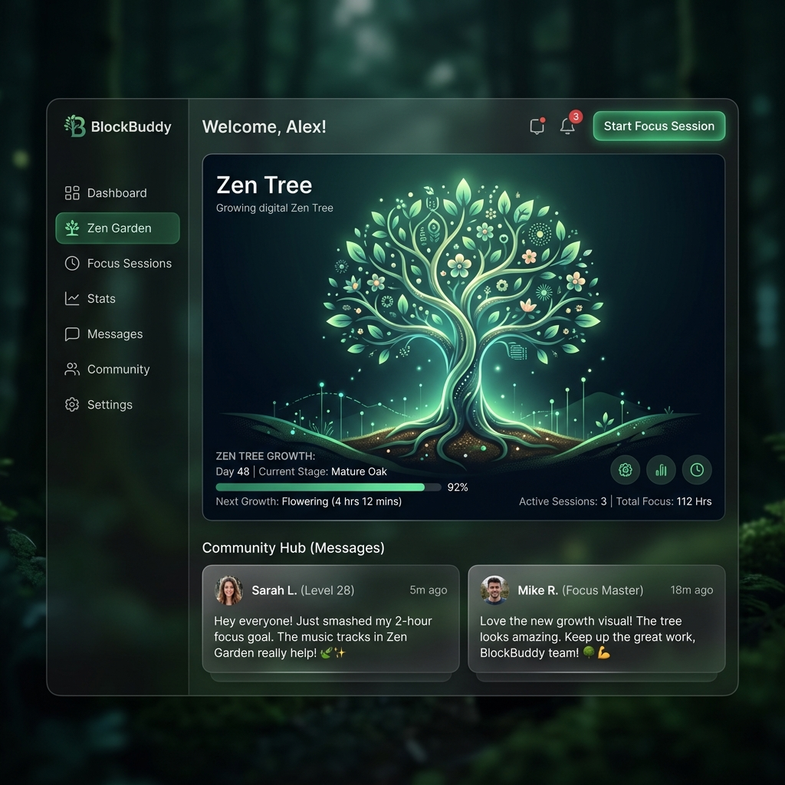

# 🌿 BlockBuddy

**A message board that grows a forest.**

Every message you post gets written permanently to the blockchain — and every message makes your tree a little bigger. Post enough, and a lone seedling becomes a canopy. It's Web3 without the jargon: connect a wallet (or don't — there's a full offline sandbox), write something, and watch it take root.

<p align="center">
  
</p>

<p align="center">
  <a href="https://opensource.org/licenses/MIT"></a>
  
  
  
</p>

---

## 🌱 What makes it different

Most fresher blockchain demos are a form and a transaction hash. BlockBuddy is built to actually be *used* — no wallet, no gas, no problem:

- **Two modes, zero friction** — no MetaMask? The app quietly falls back to a local sandbox so you can try everything instantly. Connect a wallet later and it switches to the real chain without losing the vibe.
- **On-chain, for real** — messages aren't stored in a database pretending to be decentralized. They live in a Solidity contract, batch-read with a custom `getMessages()` pagination function so the feed stays fast even as it grows.
- **A living interface, not a dashboard** — fireflies drift across the screen, the tree sways on its own, and it tilts gently as you move your mouse across it. Click the trunk. See what happens. 🌳
- **Built to be read, not just run** — full NatSpec docs on the contract, a real Hardhat/Chai test suite, and a repo you can actually clone without downloading 70MB of `node_modules`.

---

## 🔗 Live Demo

- **App**: [blockbuddy-rust.vercel.app](https://blockbuddy-rust.vercel.app/)
- **Contract** (Sepolia): [`0xYOUR_SEPOLIA_CONTRACT_ADDRESS`](https://sepolia.etherscan.io/address/0xYOUR_SEPOLIA_CONTRACT_ADDRESS)

*No wallet? No testnet ETH? Doesn't matter — open the link and start planting messages immediately in sandbox mode.*

---

## 🌲 How it works

```
 You write a message
        │
        ▼
 Wallet connected? ──No──▶ Saved locally, tree grows instantly (sandbox mode)
        │
       Yes
        │
        ▼
 Sent to PublicMessageBoard.sol on-chain
        │
        ▼
 Mined ⛏️ → fetched back in batches via getMessages()
        │
        ▼
 Tree grows a new branch 🌿
```

Every post is capped at 280 characters on-chain (not just in the UI — try to break it, the contract will reject it), and every message is permanent. That's not a limitation, it's the point: this is meant to feel a little more real than a typical CRUD demo.

---

## 🛠️ Tech Stack

| Layer | Tools |
|---|---|
| Smart Contract | Solidity 0.8.20, Hardhat, Chai/Mocha tests |
| Frontend | React 18, Vite, Ethers.js v6 |
| Styling | Hand-rolled CSS — no framework, glassmorphic dark theme |
| Deployment | Sepolia testnet + Vercel |

---

## 🚀 Running it locally

**Local sandbox (Ganache):**
```bash
# 1. Install and deploy the contract
npm install
npx hardhat run scripts/deploy.js --network ganache

# 2. Run the frontend
cd frontend
npm install
npm run dev
```
Open `http://localhost:5173` — that's it.

**Public testnet (Sepolia):**
```bash
cp .env.example .env   # add your SEPOLIA_RPC_URL and a throwaway wallet's DEPLOYER_PRIVATE_KEY
npx hardhat run scripts/deploy.js --network sepolia
```
Never use a wallet with real funds for this — testnet keys only.

---

## 🧪 Tests

```bash
npx hardhat test
```
Covers message posting, length/empty-message validation, sender attribution across multiple accounts, and pagination edge cases in `getMessages()`.

---

## 🍂 Known limitations, on purpose

- **No message deletion.** Immutability is the feature, not a bug — this is a public bulletin board on a public ledger.
- **Gas required for real posts.** Sandbox mode exists precisely so that isn't a barrier to trying the app.

---

## 📄 License

MIT — see [LICENSE](LICENSE).

---

<p align="center"><i>Built by <a href="https://github.com/crazyaditya07">@crazyaditya07</a> 🌿</i></p>
